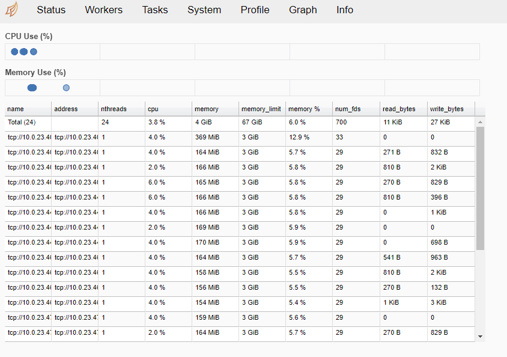

## Table of Contents

- [Table of Contents](#table-of-contents)
- [Concepts](#concepts)
- [Get started with swarm mode](#get-started-with-swarm-mode)
- [Shared file system](#shared-file-system)
- [Portainer](#portainer)

## Concepts

Thanks to [swarm mode](https://docs.docker.com/engine/swarm/) it is possible to scale out the analysis
distributing loads across multiple physical and cloud machines.
A swarm consists of multiple Docker hosts which run in swarm mode and act as managers and workers.

## Get started with swarm mode

First of all you need to have docker installed on all host machines that can communicate over a network.

### create a swarm 
On the first node create new swarm with command ```docker swarm init``` , this will returns instruction to add other nodes

### add nodes to the swarm
At this point it is possible to jump on all other nodes and join the swarm with command ```docker swarm join --token XXXXXXXX ip_of_first_node:2377``` 
To view information about nodes run ```docker node ls```
```
ID                            HOSTNAME            STATUS    AVAILABILITY   MANAGER STATUS   ENGINE VERSION
jh91w3zjh2c5xrqu8qp35rles *   photon-machine-01   Ready     Active         Reachable        20.10.3
a1y9af9xax4npkfs3fb73736j     photon-machine-02   Ready     Active         Reachable        19.03.10
slzalzsat84rq8vrlht0pdr8g     photon-machine-03   Ready     Active         Leader           19.03.10
dnybnughpeojkflz4q1o74irs     photon-machine-04   Ready     Active         Reachable        19.03.10
enr4eic2x6qd1un2qq1jbl7no     photon-machine-05   Ready     Active         Reachable        19.03.10
06a2dyk5wp6hdplti84a9rury     photon-machine-06   Ready     Active                          19.03.10
0f7xj73m98t2drfaoitf6cbrx     photon-machine-07   Ready     Active                          19.03.10
n1vt6rwebh3qczr8pdxgz7vyt     photon-machine-08   Ready     Active                          19.03.10
pipkbjkce69mhcclzcsfeuhlc     photon-machine-09   Ready     Active                          19.03.10
lad567xvfm12p7k9qyzgx67ui     photon-machine-10   Ready     Active                          19.03.10
```
### deploy a service
Now is time to deploy OROCHI as service to the swarm with command ```docker stack deploy -c docker-compose-swarm.yml orochi```
To chech the status of the stack run the command ```docker stack ps orochi``` :
```
ID             NAME                     IMAGE                                                  NODE                DESIRED STATE   CURRENT STATE           ERROR                       PORTS
vgcqh2ltr1yf   orochi_django.1          garanews/orochi_django:latest                          photon-machine-01   Running         Running 3 days ago
br974foz3iwk   orochi_es01.1            docker.elastic.co/elasticsearch/elasticsearch:7.11.0   photon-machine-06   Running         Running 3 days ago
xv3ncbh2czu6   orochi_kib01.1           docker.elastic.co/kibana/kibana:7.11.0                 photon-machine-08   Running         Running 3 days ago
wz2r0dzj7116   orochi_mailhog.1         mailhog/mailhog:v1.0.1                                 photon-machine-05   Running         Running 3 days ago
xlcrdmr1w6rp   orochi_postgres.1        garanews/orochi_postgres:latest                        photon-machine-07   Running         Running 3 days ago
3iy7uzf2x8w3   orochi_redis.1           redis:6.0.10                                           photon-machine-04   Running         Running 3 days ago
n0jyn3v33aho   orochi_scheduler.1       daskdev/dask:2021.2.0                                  photon-machine-10   Running         Running 22 hours ago
lzx3jcoy3nr2   orochi_worker01.1        garanews/orochi_worker:latest                          photon-machine-09   Running         Running 22 hours ago
```

In this way the services are distributed across the nodes of the swarm.

### scale the workers
At this point it is possible to scale the worker service with command ```docker service scale orochi_worker01=5 ```
```
orochi_worker01 scaled to 5
overall progress: 2 out of 5 tasks
1/5: running   [==================================================>]
2/5: preparing [=================================>                 ]
3/5: preparing [=================================>                 ]
4/5: preparing [=================================>                 ]
5/5: running   [==================================================>]
verify: Service converged
```
When done if run ```docker stack ps orochi ``` it will show the new workers deployed on other nodes
```
ID             NAME                     IMAGE                                                  NODE                DESIRED STATE   CURRENT STATE               ERROR                       PORTS
vgcqh2ltr1yf   orochi_django.1          garanews/orochi_django:latest                          photon-machine-01   Running         Running 3 days ago
br974foz3iwk   orochi_es01.1            docker.elastic.co/elasticsearch/elasticsearch:7.11.0   photon-machine-06   Running         Running 3 days ago
xv3ncbh2czu6   orochi_kib01.1           docker.elastic.co/kibana/kibana:7.11.0                 photon-machine-08   Running         Running 3 days ago
wz2r0dzj7116   orochi_mailhog.1         mailhog/mailhog:v1.0.1                                 photon-machine-05   Running         Running 3 days ago
xlcrdmr1w6rp   orochi_postgres.1        garanews/orochi_postgres:latest                        photon-machine-07   Running         Running 3 days ago
3iy7uzf2x8w3   orochi_redis.1           redis:6.0.10                                           photon-machine-04   Running         Running 3 days ago
n0jyn3v33aho   orochi_scheduler.1       daskdev/dask:2021.2.0                                  photon-machine-10   Running         Running 23 hours ago
lzx3jcoy3nr2   orochi_worker01.1        garanews/orochi_worker:latest                          photon-machine-09   Running         Running 23 hours ago
aqwudk1x00eti   orochi_worker01.2        garanews/orochi_worker:latest                          photon-machine-10   Running         Running about an hour ago
npwshmf8fnkc   orochi_worker01.3        garanews/orochi_worker:latest                          photon-machine-04   Running         Running about an hour ago
ly7t89jd2vm8   orochi_worker01.4        garanews/orochi_worker:latest                          photon-machine-02   Running         Running about an hour ago
uhnqh2telse0   orochi_worker01.5        garanews/orochi_worker:latest                          photon-machine-03   Running         Running about an hour ago
```
There is no needed any additional config: each worker when start on new node already know how to connect to the scheduler


## Shared file system
Django container and all worker containers need share symbols folder and media folder and for a local installation in the docker-compose.yml 2 volumes are defined:
```
    volumes:
      - media_path:/media
      - symbols_path:/opt/conda/lib/python3.8/site-packages/volatility3/symbols
```

On a swarm installation, where workers can run on different nodes, a shared file system is needed; the easyest way is to provide a NFS.
A guide to setup an NFS Mount on Ubuntu 20.04 is available [here](https://www.digitalocean.com/community/tutorials/how-to-set-up-an-nfs-mount-on-ubuntu-20-04)

In docker-compose-swarm.yml are present nfs volumes that can be used by all containers on any node:
```
volumes:
  media_path:
    driver: local
    driver_opts:
      type: "nfs"
      o: "addr=nfs_server_ip,nolock,soft,rw,nfsvers=4"
      device: ":/var/nfs/media"
  symbols_path:
    driver: local
    driver_opts:
      type: "nfs"
      o: "addr=nfs_server_ip,nolock,soft,rw,nfsvers=4"
      device: ":/var/nfs/symbols"
  postgres_data:
    driver: local
    driver_opts:
      type: "nfs"
      o: "addr=nfs_server_ip,nolock,soft,rw,nfsvers=4"
      device: ":/var/nfs/postgres/data"
  postgres_backups:
    driver: local
    driver_opts:
      type: "nfs"
      o: "addr=nfs_server_ip,nolock,soft,rw,nfsvers=4"
      device: ":/var/nfs/postgres/backups"
  elasticsearch_data:
    driver: local
    driver_opts:
      type: "nfs"
      o: "addr=nfs_server_ip,nolock,soft,rw,nfsvers=4"
      device: ":/var/nfs/elasticsearch/data"
```
## Portainer
[Portainer](https://www.portainer.io/) is a lightweight management UI which allows you to easily manage your different Docker environments (Docker hosts or Swarm clusters).
After setup the swarm, Portainer and the Portainer Agent to manage a Swarm cluster can be deployed by run
```
curl -L https://downloads.portainer.io/portainer-agent-stack.yml -o portainer-agent-stack.yml
docker stack deploy -c portainer-agent-stack.yml portainer
```

